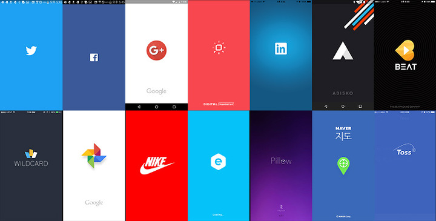
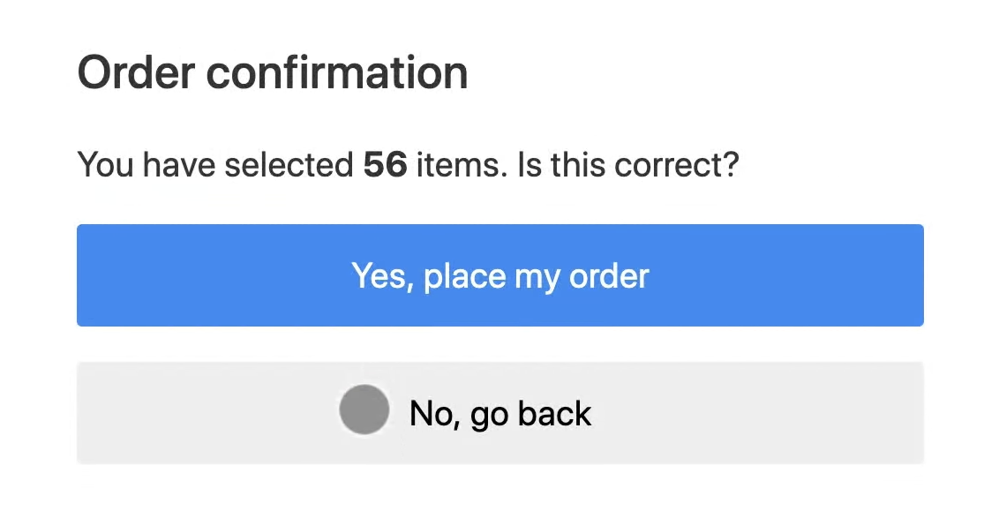
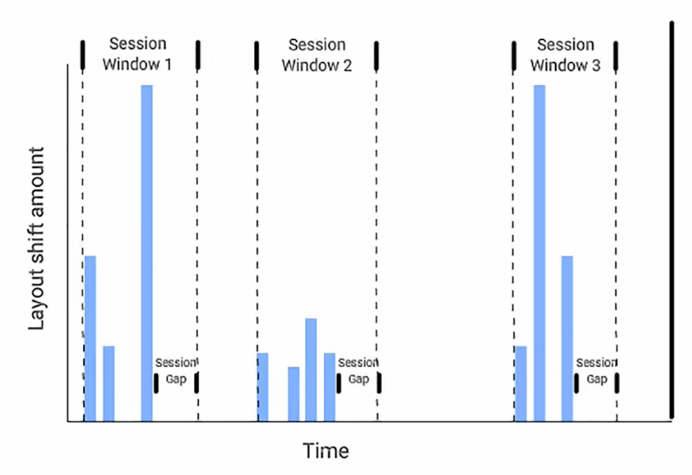
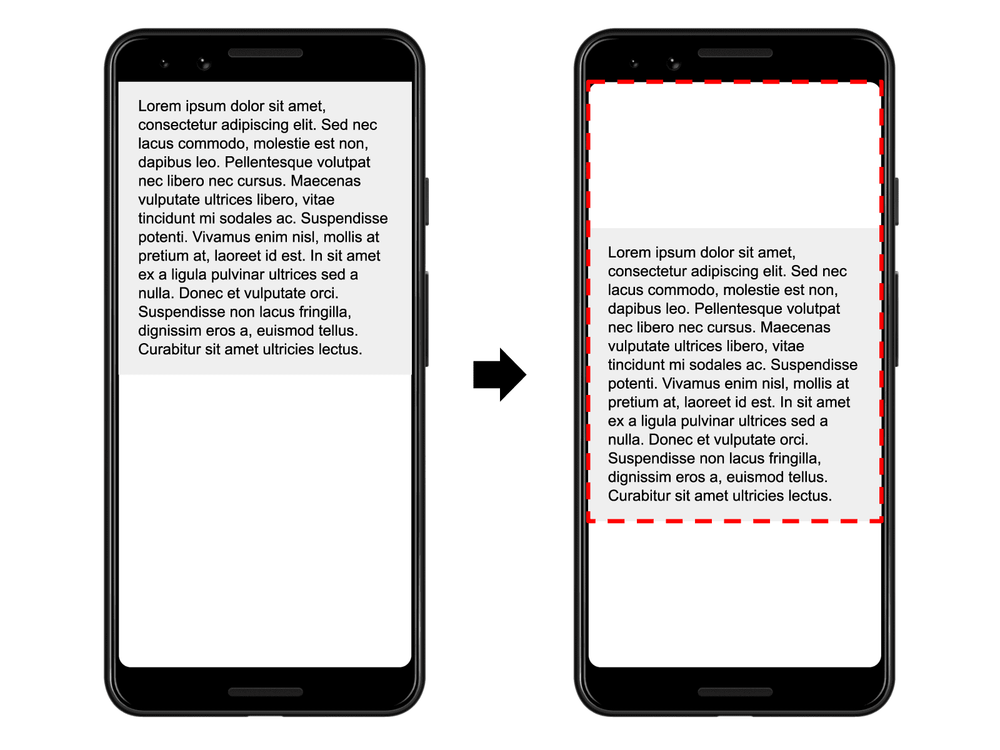
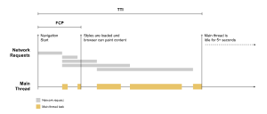

## Web Vitals

Web Vital은 웹에서의 우수한 경험을 제공하기 위해 필수적인 품질을 측정하기 위해 Google로부터 제안된 몇 가지 지표들입니다. 
이번 글에서 다루고자 하는 **Core Web Vitals**은 이러한 Web Vital 중에서도 가장 중요한 지표들을 의미합니다.

## Core Web Vitals

Core Web Vitals은 다음과 같은 지표들을 포함하며, 각각이 측정하고자 하는 항목을 대략적으로 살펴보면 다음과 같습니다.

- **Largest Contentful Paint (LCP)**: *로딩*(loading)을 측정하는 지표
- **First Input Delay (FID)**: *인터랙션*(interactivity)을 측정하는 지표
- **Cumulative Layout Shift (CLS)**: *시각적 안정성*(visual stability)을 측정하는 지표


Core Web Vital은 지속적으로 연구 및 개선, 추가되고 있는 지표들이기 때문에, 훗날에는 위 3가지가 아닐 가능성이 있습니다.
대표적으로, 현재는 INP(Interaction to Next Paint)라는 지표가, 위의 FID를 대체하기 위한 측정 항목으로 제안되고 있으며, 이는 24년 3월로 예정되어 있습니다.
INP에 대한 내용 역시 아래의 섹션에서 살펴볼 계획입니다.

이제 각 지표에 대해 보다 상세하게 살펴보겠습니다.

### Largest Contentful Paint (LCP)


**LCP**는 사용자가 웹 페이지를 처음으로 이동한 시점을 기준으로, **가장 큰 이미지 또는 텍스트 블록이 렌더링되기까지 걸리는 시간을 측정**하는 지표입니다.

이전에는 페이지 로딩 성능에 대한 측정을 할 때, `load`, `DOMContentLoaded`와 같은 이벤트를 사용했으나, 이것이 "사용자의 화면에 무엇인가 표시됨"을 의미하는 것과는 거리가 멀었습니다.

한편, 이와 유사한 FCP(First Contentful Paint) 역시 사용자 중심의 로딩 성능 측정을 위한 것이지만, 이 경우 페이지 로드 시 실제 컨텐츠와 관련없이 등장하는 **스피너** 또는 **스플래시 스크린**이 활용되는 웹 사이트의 경우 FCP가 사용자와 큰 관련이 있다고 보기 어렵다는 문제가 있습니다.



**좋은 LCP 점수란**, 해당 최대 컨텐츠의 렌더링 시간이 **2.5초** 이하인 경우를 의미합니다. 그 이상이 되는 경우, 개선이 필요한 것으로 여기고, 만약 **4초** 이상이 된다면 나쁜 LCP 점수를 갖는다고 보고 있습니다.

#### 그럼, Largest Content를 어떻게 정하나요?

실제 [**Largest Contentful Paint API**](https://w3c.github.io/largest-contentful-paint/)에 정의된 바에 따르면 Largest Content로 간주되는 요소는 아래와 같습니다.

- `` 요소
- `<svg>` 요소 내 `<image>` 요소
- 포스터 이미지가 있는 `<video>` 요소
- `url()` 함수를 통해 로드된 배경 이미지가 있는 요소(CSS 그라데이션과 반대)
- 텍스트 노드 또는 기타 인라인 수준 텍스트 요소 하위 요소를 포함하는 블록 수준 요소.
- `<video>` 요소 자동재생을 위해 그린 첫 번째 프레임 (2023년 8월 기준)
- 애니메이션 GIF와 같은 애니메이션 이미지 형식의 첫 번째 프레임 (2023년 8월 기준)

이처럼 "가장 큰 컨텐츠"로 간주되는 것에 대한 범위가 제한적인 것은 그 측정 작업 자체를 간단하게 유지하기 위함입니다. 향후 연구의 진행에 따라 점차 추가되는 요소가 있을 수 있습니다.

또, 단순히 요소를 고려하는 것 이상으로, 사용자에게 "컨텐츠가 없음"으로 인식될 수 있는 특정 요소들은 제외하기 위해 특정한 휴리스틱(heuristic)을 적용하고 있습니다. 이는 브라우저마다 차이가 있을 수 있는데, Chromium 기반의 브라우저에는 다음의 휴리스틱들이 적용됩니다.

- 사용자에게 보이지 않는, `opacity`가 `0`인 요소
- 전체 뷰포트 영역을 덮는 요소 (컨텐츠가 아닌 배경으로 간주될만한 요소)
- 페이지의 실제 컨텐츠를 반영하지 않는, 낮은 엔트로피를 지닌 placeholder 이미지

브라우저들은 자체적으로 "가장 큰 컨텐츠 요소"가 무엇인지 정확히 판단하기 위해 이러한 휴리스틱들을 지속적으로 개선하고 있습니다.

#### "요소의 크기"는 어떤 기준으로 정해지나요?

LCP를 위해 리포트되는 요소의 크기란, 일반적으로 "뷰포트 내에서 사용자에게 보여지는 크기"를 의미합니다. 이는 다시 말해, 

1. 요소가 뷰포트 외부로 확장되거나, `overflow`로 인해 요소 일부가 잘리거나 보이지않는 경우는 여기서 말하는 "크기"에 포함되지 않습니다.

2. 텍스트의 경우 전체 텍스트 노드를 감싸는 가장 작은 블록 수준 요소의 크기만 고려됩니다.

3. 모든 요소에서, CSS를 통해 적용된 `margin`, `padding`, `border`는 고려되지 않습니다.

#### LCP는 어느 시점에 리포트되나요?

여러 단계에 거쳐 로드가 진행되는 웹 페이지의 경우, 가장 큰 요소가 변경되는 일이 충분히 발생할 수 있습니다.

이러한 상황에 대응하기 위해, 브라우저는 가장 큰 것으로 인식되는 요소가 변경될 때마다 `largest-contentful-paint` 타입의 [`PerformanceEntry`](https://developer.mozilla.org/en-US/docs/Web/API/PerformanceEntry)를 디스패치합니다. 

예를 들어, 최초에 헤더 텍스트에 해당하는 `<h1>` 요소가 `largest-contenful-paint` 엔트리로 디스패치되었더라도, 이후에 뷰포트 내에 가장 큰 요소가 변경되어 새로운 `` 요소가 가장 큰 요소로 인식되면, `` 요소에 대한 `largest-contentful-paint` 엔트리가 새로 디스패치됩니다.

그렇기 때문에 만약 분석을 위해서 JS 상으로 `PerformanceEntry` 정보를 수집하고자 한다면, 가장 마지막에 전달된 `PerformanceEntry`만을 분석 서비스에 보고하여 다루도록 해야합니다.

브라우저는 사용자가 페이지에 대해 어떤 상호작용을 하는 시점에 LCP 리포트를 중지합니다. (ex. 클릭, 스크롤 등) 이는 사용자의 인터랙션에 의해 페이지에 보여지는 내용이 변경될 수 있기 때문입니다.

> 유의점: 요소는 렌더링되어 실제로 사용자에게 표시되는 경우에만 가장 큰 요소로 인식됩니다. 아직 로드되지 않은 이미지는 렌더링된 것으로 간주하지 않고, 웹 폰트를 사용할 경우에 발생하는 [폰트 블록](https://developer.mozilla.org/en-US/docs/Web/CSS/@font-face/font-display#The_font_display_timeline) 시점에도 가장 큰 요소로 인식되지 않습니다.
>
> 또한, 이미 리포트된 요소의 크기나 위치를 변경하더라도 새로운 LCP가 디스패치되지는 않습니다. 뷰포트 내에 있는 요소의 초기 크기와 위치만 고려됩니다.


#### `Timing-Allow-Origin` 헤더

보안 상의 이유로, 교차 출처 이미지 내에 [`Timing-Allow-Origin`](https://developer.mozilla.org/en-US/docs/Web/HTTP/Headers/Timing-Allow-Origin) 헤더가 존재하지 않는 경우에는 이미지의 렌더링 시간을 측정할 수 없습니다. 이 경우, LCP는 대신에 해당 이미지의 로드 시간을 측정합니다.

여기서 말하는 로드 시간과 렌더링 시간은 비슷한 듯 의미하는 바가 다릅니다. 이미지의 로드 시간은 이미지가 브라우저에 의해 다운로드되는 시간을 의미하고, 렌더링 시간은 로드된 이미지가 브라우저에 의해 실제로 렌더링되어 사용자에게 노출되는 시간을 의미합니다.

이 경우, LCP가 FCP(First Contentful Paint)보다 빠르게 보고되는, 실질적으로는 불가능한 상황이 발생할 수 있습니다. 이는 실제 지표가 아니며, 앞서 말한 헤더에 의한 보안 상의 제한으로 발생하는 문제입니다.

즉, LCP 측정의 정확도를 높이기 위해서는 가능한 교차 출처 컨텐츠에는 `Timing-Allow-Origin` 헤더를 설정해두는 것이 좋습니다.

### Cumulative Layout Shift (CLS)


**CLS**는 사용자가 웹 페이지를 처음으로 이동한 시점을 기준으로, **화면에 보이는 요소들이 얼마나 불안정하게 움직이는지를 측정**하는 지표입니다. 이는 **시각적 안정성**을 측정하는 중요한 사용자 중심 측정항목입니다.

[](https://web.dev/articles/cls/video/web-dev-assets/layout-instability-api/layout-instability2.webm)

CLS는 일반적으로, 비동기식으로 로드되는 리소스 및 DOM 요소가 기존의 컨텐츠 위에 동적으로 추가됨에 따라 페이지 컨텐츠가 예상치 못하게 움직이면서 발생합니다.

이 문제가 좀 더 껄끄러운 이유는, 일반적으로 개발 단계에서 사이트가 동작하는 방식과, 프로덕셔닝된 웹 사이트의 실제 사용자가 이용하는 방식 간에 차이가 있기 때문입니다. 주로 다음과 같은 경우가 있을 수 있습니다.

- 개인화 및 서드파티 컨텐츠들은 개발 환경에서는 프로덕션 환경과 동일하게 작동하지 않는 경우가 많습니다.
- 테스트 이미지들은 이미 개발자의 브라우저 캐시에 있는 경우가 많습니다.
- 로컬에서 실행되는 API 호출이 워낙 빨라, CLS가 눈에 띄지 않을 수 있습니다.

이런 부분에서, CLS 지표는 실제 사용자에게 레이아웃의 이동이 얼마나 자주 발생하는지 측정해 문제를 해결하는 데 도움을 줍니다.

#### CLS는 어떻게 측정되나요?

CLS는 한 페이지의 전체 수명 동안에 발생하는 모든 예상치 못한 형태의 레이아웃 시프트(Layout shift)에 대한 레이아웃 변경 점수의 **가장 큰 버스트**(burst)를 측정한 것입니다.

레이아웃 시프트은 표시되는 요소가 하나의 렌더링된 프레임에서 다음 프레임으로 넘어가 위치를 변경할 때마다 발생합니다.

**세션 윈도우**(Session Window)라고도 하는 **레이아웃 시프트의 단일 버스트**는 하나 이상의 개별 레이아웃 시프트가 1초 이내로 빠르고 연속적으로 발생하는 경우를 의미합니다. 전체 윈도우 지속 시간은 최대 5초입니다.

여기서 CLS에 해당하는 **가장 큰 버스트**란 해당 윈도우 내 모든 레이아웃 시프트의 최대 누적 점수가 있는 세션 윈도우를 가리킵니다.



> **주의**: 사실, 이전에는 CLS가 "가장 큰 버스트"를 측정하는 것이 아니라, 모든 개별 레이아웃 시프트 점수의 총합을 측정했었습니다. 이에 따라 일부 툴은 기존의 점수 측정 방식을 사용하고 있을 가능성이 있습니다.

**좋은 CLS 점수**란 웹 사이트의 CLS 점수가 **0.1** 이하인 경우를 의미합니다. 만약 **0.25** 이상이 된다면 나쁜 CLS 점수를 갖는다고 보고 있습니다.

#### 레이아웃 시프트를 구체적으로 어떻게 정의하나요?

레이아웃 시프트는 [**Layout instability API**](https://github.com/WICG/layout-instability)에 의해 정의됩니다. 여기서는 뷰포트 내에서 볼 수 있는 어떤 요소의 위치가 초기 위치에서 이동할 때마다 `layout-shift` 엔트리를 리포트합니다. 이러한 요소는 곧 **불안정한 요소**(**unstable element**)로 불립니다.

여기서 주요한 점은, 기존 요소의 **시작 위치가 변경될 때**만 고려한다는 것입니다. 새로운 요소가 DOM에 추가되거나, 기존 요소의 크기가 변경되는 경우에는 레이아웃 시프트가 발생하지 않습니다. (그 변경으로 인해 다른 요소의 시작 위치가 변경되는 것이 아닌 한)

구체적인 공식은 아래와 같습니다.

```
layout shift score = impact fraction * distance fraction
```

##### 영향 비율(Impact fraction)

**영향 비율**(**Impact fraction**)은 불안정한 요소가 두 프레임 사이의 뷰포트 영역에 얼마나 많은 영향을 끼쳤는지를 측정합니다.

뷰포트 중 이전 프레임과 현재 프레임 사이 모든 불안정한 요소의 표시 영역에 해당하는 부분을 합집합을 고려한 것이 현재 프레임의 영향 비율입니다.

아래 예시를 살펴보면, 한 요소가 최초에 뷰포트의 절반을 차지하고 있었으나, 요소 이동이 발생하면서 뷰포트 높이의 25%만큼 아래로 내려가게 되었습니다. 이 경우, 기존에 차지하던 영역과 이동한 영역의 합집합을 따져보면, 영향 비율은 `0.75`(75%)가 됩니다.




##### 거리 비율(Distance fraction)

**거리 비율**(**Distance fraction**)은 불안정한 요소가 뷰포트를 기준으로 두 프레임 간에 얼마나 멀리 이동했는지를 측정합니다. 거리 비율은 프레임에서 불안정한 요소가 이동한 최대 거리(가로 혹은 세로)를 뷰포트의 가장 큰 치수(너비 또는 높이 중 더 큰 값)으로 나눈 값입니다.

다시 앞서 살펴본 예시를 바라보면, 여기서 뷰포트의 가장 큰 치수는 높이이며, 불안정한 요소가 이동한 거리는 뷰포트 높이의 25%에 해당합니다. 이 경우, 거리 비율은 `0.25`(25%)가 됩니다.

결국, 앞서 살핀 공식을 통해 레이아웃 시프트를 직접 계산해보면 아래와 같습니다.

```
layout shift score = 0.75 * 0.25 = 0.1875
```

> **정보**: 원래 레이아웃 점수는 영향 비율(impact fraction)만을 고려하여 계산되었습니다. 하지만, 이 경우 거대한 요소는 아주 조금만 움직여도 지나치게 높은 레이아웃 시프트 점수가 부여되는 문제가 있었기 때문에 거리 비율(distance fraction)을 추가로 고려하게 되었습니다.


#### 그럼 레이아웃 시프트는 나쁜건가요?

사실 모든 레이아웃 시프트가 나쁜건 아닙니다. 실제로 많은 동적 웹 애플리케이션이 페이지 요소의 시작 위치를 종종 변경합니다.

중요한 것은, **예상이 가능한가**입니다. 레이아웃 시프트는 사용자가 예상치 못한 경우에 나쁜 것으로 간주됩니다. 반면 사용자의 인터랙션에 대한 응답으로 발생하는 레이아웃은 일반적으로 괜찮습니다.

이러한 가정에 따라, 사용자의 입력 이후 500ms 이내에 발생하는 레이아웃 시프트는 `hadRecentInput` 플래그를 갖추고 있어, CLS 계산에서 제외됩니다. 단, 여기서 말하는 사용자 입력이란, 탭/클릭/키입력 과 같이 단편적으로 발생하는 입력 이벤트에만 해당합니다. 스크롤/드래그/핀치/줌과 같은 연속적인 입력 이벤트는 제외됩니다.


#### 애니메이션의 경우는요?

애니메이션 및 트랜지션 역시 사용자들을 놀래키지 않으면서 컨텐츠를 업데이트할 좋은 방법입니다. 갑작스레 위치가 바뀌는 컨텐츠는 거의 항상 나쁜 사용자 경험으로 이어집니다. 그러나 점차 이동하는 컨텐츠는 사용자에게 있어 지금 어떤 일이 벌어지고 있는지에 대해 쉽게 이해할 수 있도록 해줍니다.

또, `prefers-reduced-motion` 미디어 쿼리를 존중해주어야 합니다. 일부 사이트 방문자는 애니메이션에 의해 혼란스러워하거나 불편함을 느낄 수 있기 때문입니다.

애니메이션을 적용할 때는 `transform` CSS 속성을 활용하여 레이아웃 시프트를 발생시키지 않고 처리할 수 있습니다.

- `width`, `height`의 변경 대신 `transform: scale()`을 사용
- `top`, `left`의 변경 대신 `transform: translate()`를 사용

### First Input Delay (FID)


**FID**는 사용자가 웹 페이지와 처음으로 상호작용을 한 시점과 브라우저가 해당 인터랙션에 대한 반응으로 이벤트 핸들러를 실제로 호출 가능해지는 시점까지 걸리는 시간을 측정하는 지표입니다.

**좋은 FID 점수**란, 웹 페이지의 FID가 **100ms** 이하인 경우를 의미합니다. 만약 **300ms** 이상이 된다면 나쁜 FID 점수를 갖는다고 보고 있습니다.

#### FID 깊게 들여다보기

일반적으로 입력 지연(Input Delay, = Input Latency)은 브라우저의 메인 스레드가 다른 작업을 처리하느라 바빠서 사용자 입력에 대한 응답을 처리할 수 없기 때문에 발생합니다. 이 문제의 일반적인 이유 중 하나는 브라우저가 앱에서 로드한 대용량의 JS 파일을 파싱하고 실행하느라 바쁜 경우입니다. 이 때는 로드 중인 JS가 다른 작업을 수행할 수 있기 때문에, 이벤트 리스너를 실행할 수 없도록 브라우저에서 처리됩니다.

> **정보**: FID는 이벤트 처리가 이루어지기 전까지의 "지연"(delay)에 대해서만 측정합니다. 이는 다시 말해, 이벤트 처리 시간 자체나 핸들러를 실행한 이후 브라우저가 UI를 업데이트하는데 걸리는 시간까지는 측정하지 않습니다.

FID가 길어질 수 있는 전형적인 시나리오에 대해 간단하게 살펴봅시다.



위의 그림처럼, 브라우저는 여러 리소스들을 네트워크 요청을 통해 가져오고, 이러한 리소스들을 다운로드하고 나면 메인 스레드에서 처리합니다. 이 시점에서 메인 스레드는 순간적으로 바빠지기 때문에, 다른 작업을 처리할 수 없게 되고 이 구간은 위의 베이지색의 작업 영역으로 표시됩니다.

FID는 일반적으로 FCP와 TTI(Time to Interactive) 사이에 발생합니다. 왜냐하면 이 시점에서 브라우저 상에는 컨텐츠의 일부가 렌더링되긴 했지만, 아직 실제로 인터랙션이 가능한 상태는 아니기 때문입니다.


만약 FCP 이후 저 긴 작업이 처리되는 시점에서 사용자의 첫 인터랙션이 발생한다면 이 시점에서 입력 지연(Input Delay)이 발생합니다. 입력은 브라우저가 작업을 처리하는 도중에 발생하기 때문에, 입력에 응답하려면 브라우저가 해당 작업을 먼저 처리해야만 합니다. 그리고 이에 따라 사용자가 대기해야만 하는 바로 그 시간이 바로 FID가 됩니다.

> **참고**: 이 예시에서는 사용자가 우연하게 메인 스레드가 가장 바쁜 시점에 페이지와 상호작용했습니다. 만약 사용자가 좀 더 일찍 페이지와 상호작용해서 어쩌다 메인 스레드가 바쁜 시점에 상호작용하지 않았다면, FID는 발생하지 않았을 수도 있습니다. 이러한 입력 지연의 차이는 해당 지표를 활용할 때 단일한 값이 아닌, FID 값의 분포를 전반적으로 살펴보는 것이 얼마나 중요한지 알려줍니다.

#### 이벤트 리스너가 없는 경우에는 어떻게 하나요?

FID는 입력 이벤트가 수신된 시점과, 메인 스레드가 다음의 유휴(idle) 상태가 되는 시점 그 사이의 간격을 측정합니다. 다시 말해, **이벤트 리스너가 등록되지 않았어도 FID는 측정됩니다**. 그 이유는, 이벤트 리스너를 필요로 하지 않는 많은 상호작용도, 결국 실행하기 위해서 스레드가 유휴 상태에 있어야 하기 때문입니다.

예를 들어, 아래의 HTML 요소 역시 사용자 상호작용에 대해 응답하려면 메인 스레드가 유휴 상태에 있어야 합니다.

- `<input>`, `<textarea>`
- `<select>`
- `<a>`

### Interaction to Next Paint (INP)

좋은 반응성이란 웹 페이지가 인터랙션에 대해 얼마나 빠르게 응답하는지를 의미합니다. 웹 페이지가 사용자의 인터랙션에 대해 응답하는 결과는 시각적인 피드백으로 전달됩니다.

일부 인터랙션은 다른 인터랙션에 비해 비교적 오랜 시간이 걸릴 수도 있습니다. 이런 경우에는 사용자에게 뭔가 시각적인 피드백을 통해 "무엇인가 일어나고 있음"를 알려주는 것이 중요합니다. 다음 페인트가 일어나기 전까지의 시간이 이를 수행할 수 있는 가장 빠른 기회입니다. **INP**는 인터랙션의 모든 최종적인 결과(ex. 네트워크를 통해 가져온 리소스 보여주기 / 비동기 작업으로 인한 UI 업데이트)를 측정하는 것이 아니라, 다음 페인트가 차단되어 있는 시간을 측정하는 것입니다. 시각적인 피드백의 지연은 페이지가 사용자에게 무응답 상태로 보이도록 하는 인상을 줄 수 있기 때문입니다.

INP의 목표는 사용자가 인터랙션을 시작한 시점부터 다음 프레임이 그려질 때까지 사용자가 하는 모든 또는 대부분의 인터랙션에 대해 가능한 짧은 시간을 확보하는 것입니다.

<video src="https://web.dev/static/articles/inp/video/jL3OLOhcWUQDnR4XjewLBx4e3PC3/WSmcjiQC4lyLxGoES4dd.mp4" ></video>

위의 예시 동영상에서, 우측의 아코디언 UI는 클릭한 즉시 시각적 피드백을 제공하지만, 좌측의 아코디언 UI의 경우 장기적인 태스크가 존재하여 사용자가 클릭한 직후에 시각적 피드백이 제공되지 않습니다. 이 때문에 사용자는 클릭한 것이 제대로 반영되었는지를 알 수 없고, 이는 나쁜 사용자 경험으로 이어집니다.

#### 그래서, INP가 뭔가요?


INP는 사용자가 페이지를 방문한 동안에 발생하는 모든 클릭, 탭, 키보드 상호작용의 지연시간을 관찰하여 사용자 인터랙션에 대한 페이지 전반적인 응답성을 평가하는 지표입니다. 최종적인 INP 값은 이상치(outlier)를 제외하고 관찰한 가장 긴 인터랙션에 해당합니다.

여기서 말하는 *인터랙션* 이란, 동일한 사용자 제스처 중에 실행되는 이벤트 핸들러의 그룹입니다. 예를 들어, 터치스크린 디바이스의 경우에는 `pointerup`, `pointerdown`, `click`과 같은 여러 이벤트가 포함됩니다. 인터랙션은 JS, CSS, 빌트인 브라우저 컨트롤(ex. 폼 요소) 또는 이들의 조합에 의해 다루어질 수 있습니다.

인터랙션의 지연 시간(latency)는 사용자가 인터랙션을 시작한 시점에서부터 다음 프레임에 시각적 프레임이 표시되는 순간까지의 인터랙션을 구동하는 이벤트 핸들러 그룹 중 가장 긴 단일 시간으로 구성됩니다.

**좋은 INP 점수**는 200ms 이하인 경우를 의미합니다. 만약 500ms 이상이 된다면 나쁜 INP 점수를 갖는다고 봅니다.


브라우저는 체크박스, 라디오, CSS에 의해 제어되는 컨트롤 등 JS로 구동되지 않는 컨트롤을 통해 인터랙션을 제공하기도 하지만, 인터랙션의 주요 동인은 대부분 자바스크립트입니다.

INP의 경우, **다음과 같은 인터랙션 타입만 관찰됩니다**.

- 마우스 클릭
- 터치스크린이 있는 기기를 태핑
- 물리적 또는 화면 상의 키보드에서 키 누르기

> **키 포인트**: 마우스 오버(=hover)와 스크롤은 INP에 반영되지 않습니다. 그러나 키보드로 스크롤하는 경우에는 키 입력에 포함되며, 이는 INP가 측정하는 다른 이벤트를 트리거할 수 있습니다. 스크롤로 인한 모든 결과는 INP 계산 방식에 반영되지 않습니다.

인터랙션은 기본 문서 또는 문서에 삽입된 iframe을 통해 이루어집니다. 최종 사용자는 iframe에 무엇이 있는지 여부를 알 수 없고, 따라서 최상위 페이지의 사용자 경험을 측정하기 위해서는 iframe 내의 INP가 필요합니다. JS 웹 API는 iframe 컨텐츠에 액세스할 수 없기 때문에 iframe 내 INP를 측정하지 못할 수 있으며, 이는 [CrUX와 RUM의 차이](https://web.dev/articles/crux-and-rum-differences?hl=ko#iframes)로 드러납니다.

인터랙션이 여러 이벤트가 존재하는 두 부분으로 구성될 수 있는 경우도 있습니다. 예를 들어 키 입력은 `keydown`, `keypress`, 그리고 `keyup` 이벤트로 구성되고, 탭 인터랙션은 `pointerup`, `pointerdown` 이벤트가 포함됩니다. 이 때는 인터랙션 내에서 가장 지속 시간이 긴 이벤트가 인터랙션의 지연 시간으로 선택됩니다.


INP는 사용자가 페이지를 떠날 때 계산되며, 전체 페이지 수명 주기 동안에 페이지의 전반적인 응답성을 나타내는 단일의 값이 됩니다. **INP가 낮다는 것은 페이지가 사용자 입력에 안정적으로 반응한다는 것을 의미합니다**.


## 마치며

이번 포스트에서는 Core Web Vitals에 대해 꽤 길게 살펴보았습니다. 다음의 포스트에서는 Core Web Vitals를 실제로 측정하고, 개선하는 방법에 대해서 실습을 거쳐 적용해볼 예정입니다.

## 참조
- [https://web.dev/articles/vitals?hl=ko](https://web.dev/articles/vitals?hl=ko)
